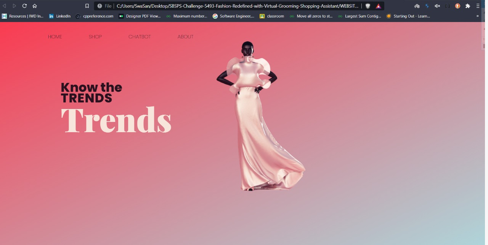
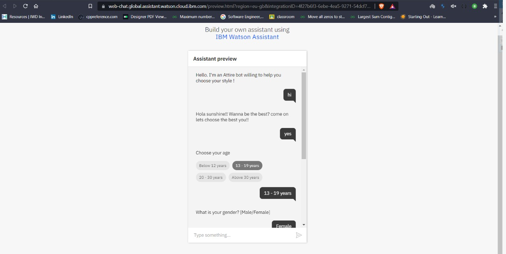
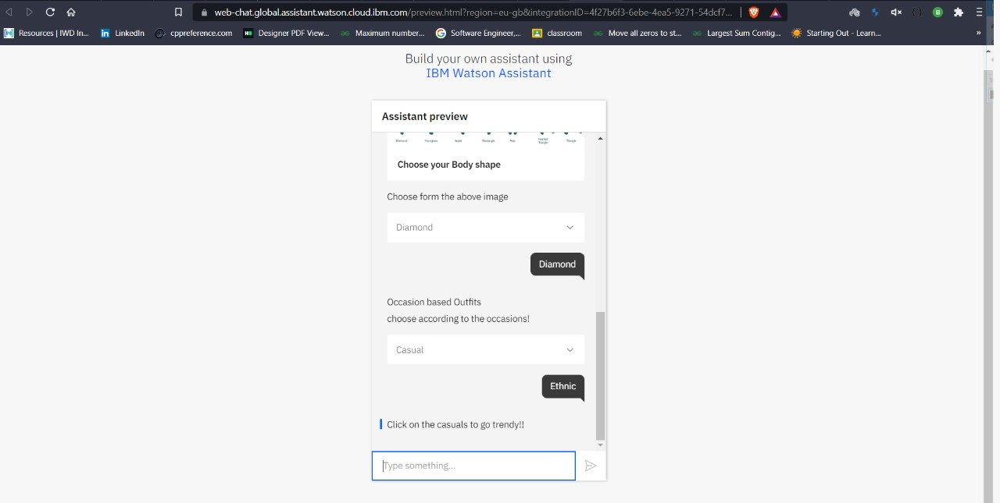
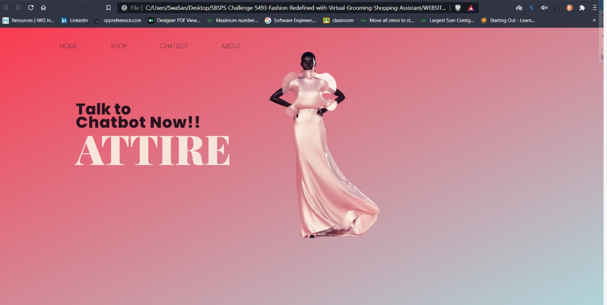
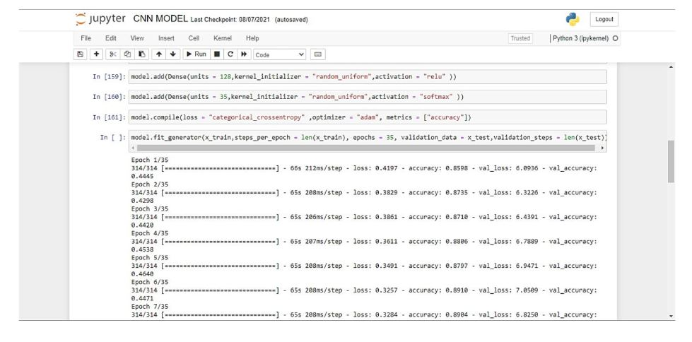
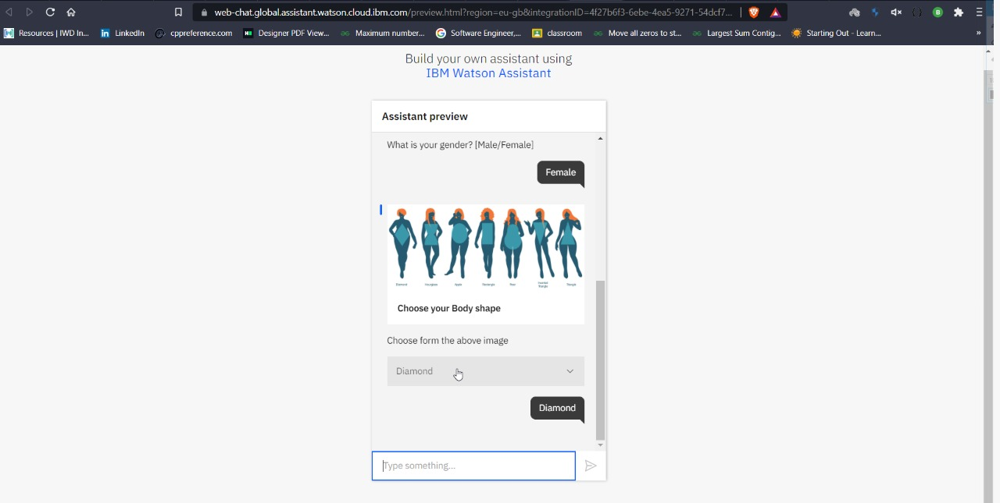
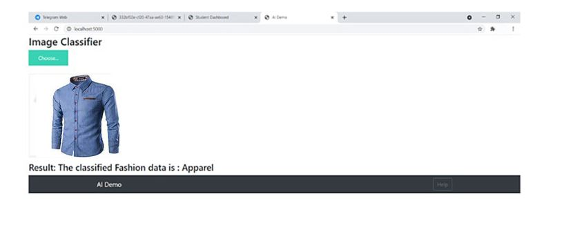
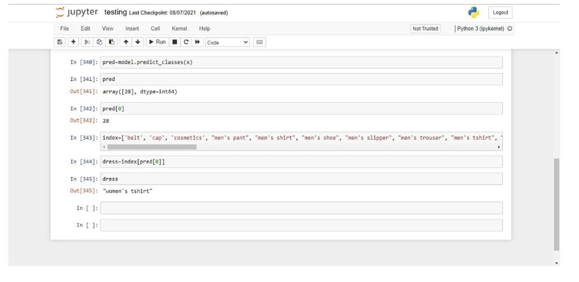
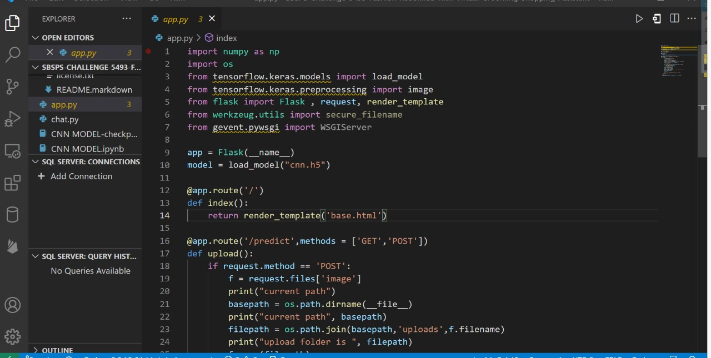

# IBM-Fashion-bot
# Attire

# Team: 404 Not Found
# Team Members: 
1. Swathika K
2. Shanthini D
3. Nivetha K
4. Prithika Lakshmi B

# *Introduction*
************
"Fashion is not something that exists in dresses only. Fashion is in the sky, in the street. Fashion has to do with ideas, the way we live, what is happening."

Novelty/Uniqueness
-> Attractive and unique interface/ UI UX resulting from our teams creativity
-> Chatbot that provides output and recommendations for different age groups
-> Constant compliments by chatbot for the most optimal dress recommendations to increase user    satisfaction. 
-> Detailed input obtaining for precise recommendation 
-> Additional feature of providing information on clothing stores and discounts based on users preference of clothes.
-> suggestions based on new trends in the market 
-> Updates on new offers and ongoing trends 

# *Business Impact*
*******************

The application if deployed, would be user friendly with the implementation of chatbot enhancing ze's interaction with it. 

This would have a wide scope as most of the clothing brands and popular E-commerce apps like Amazon, Ebay and Shein would profit by the variety of choices they provide to customers using the virtual grooming application. Not only that, the user would have the platform to realize what type of fashionable clothing would suit him/her the best, and prefer the recommended clothes hopefully.

# *Scope of the work*
*********************

Target Audience would be everyone starting right from children, teens and adults. 
We prefer to obtain the users age range to produce the best solution after processing their image and analyzing their features.

This would have a wide scope as most of the clothing brands and popular E-commerce apps like Amazon, Ebay and Shein would profit by the variety of choices they provide to customers using the virtual grooming application. Not only that, the user would have the platform to realize what type of fashionable clothing would suit him/her the best, and prefer the recommended clothes hopefully.

Project Description Video : https://youtu.be/tOZpYbL3F9o

# *Thank you*
